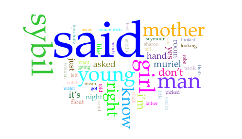

# Digital Analysis of *A Perfect Day for Bananafish*

## Project Introduction

This repository is an example exercise for a course in Modelling Textual Data. It contains a digital literary analysis of the short story *Perfect Day for Bananafish* by J.D. Salinger. The analysis is conducted using Voyant Tools.

## Text and Source

- **Title:** *A Perfect Day for Bananafish*
- **Author:** J.D. Salinger
- **Language:** English  
- **Edition used:** Unknown
- **Source:** Moodle

## Repository Contents

- `README.md` - Project description

## Wordcloud

<iframe style='width: 498px; height: 322px;' src='https://voyant-tools.org/tool/Trends/?query=said&query=sybil&query=girl&query=young&query=man&corpus=1fd87be13a9af67e30677f94eefdf9c5'></iframe>
